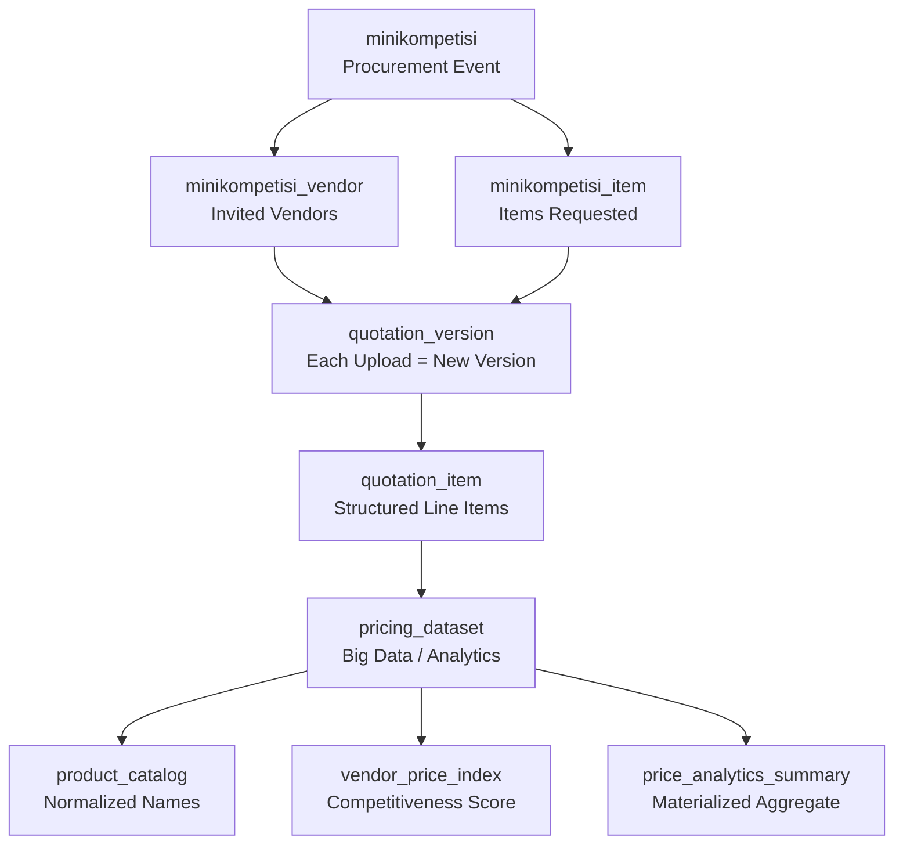
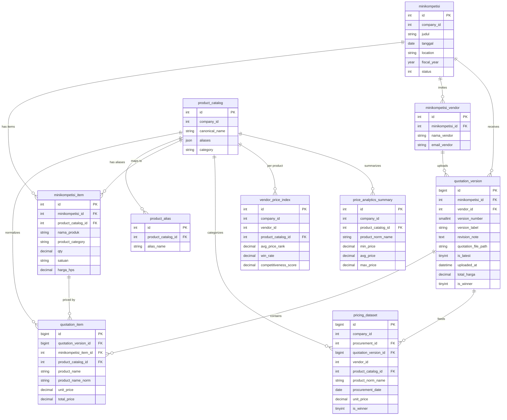

# Mini Competition — Price Intelligence Architecture

> **Scope**: Redesign of `minikompetisi` module to support quotation versioning, structured pricing data, and long-term procurement intelligence.
> **Stack**: PHP (Yii2 legacy) + MySQL 8+ / MariaDB 10.6+

---

## Table of Contents
1. [Current State Analysis](#1-current-state-analysis)
2. [Target Architecture Overview](#2-target-architecture-overview)
3. [Database Schema (Full SQL)](#3-database-schema)
4. [Table Relationship Diagram](#4-relationship-diagram)
5. [Feature 1 — Quotation Versioning](#5-feature-1--quotation-versioning)
6. [Feature 2 — Structured Quotation Items](#6-feature-2--structured-quotation-items)
7. [Feature 3 — Pricing Dataset / Data Warehouse](#7-feature-3--pricing-dataset)
8. [Feature 4 — Product Price Analysis Queries](#8-feature-4--price-analysis-queries)
9. [Feature 5 — Vendor Competitiveness](#9-feature-5--vendor-competitiveness)
10. [Feature 6 — Product Similarity & Normalization](#10-feature-6--product-similarity--normalization)
11. [Feature 7 — Big Data Ready Design](#11-feature-7--big-data-ready-design)
12. [Feature 8 — Migration Strategy](#12-feature-8--migration-strategy)
13. [PHP Refactoring Strategy](#13-php-refactoring-strategy)
14. [Data Ingestion Pipeline](#14-data-ingestion-pipeline)
15. [Price Intelligence Dashboard](#15-price-intelligence-dashboard)

---

## 1. Current State Analysis

### What exists today

| Table | Purpose | Problem |
|---|---|---|
| `minikompetisi` | Procurement event header | Missing `company_id`, no status lifecycle |
| `minikompetisi_item` | Items requested | No category, no normalization |
| `minikompetisi_vendor` | Vendors invited | No link to master vendor table |
| `minikompetisi_penawaran` | Vendor offer header | **REPLACE strategy** — old data deleted on re-upload |
| `minikompetisi_penawaran_item` | Offer line items | No link to pricing dataset |

### Critical Gaps
- [actionImport()](file:///c:/laragon/www/vms2/controllers/MinikompetisiController.php#346-422) calls `MinikompetisiPenawaran::deleteAll(...)` — **history is destroyed** on each upload
- No versioning column, no `revision_note`, no audit trail
- `minikompetisi_item.nama_produk` is free text — no normalization possible
- No `company_id` multi-tenancy filter anywhere
- No pricing history table whatsoever

---

## 2. Target Architecture Overview



---

## 3. Database Schema

### 3.1 Core Tables (enhanced existing)

```sql
-- ============================================================
-- Enhanced: minikompetisi (add company_id, location)
-- ============================================================
ALTER TABLE minikompetisi
    ADD COLUMN company_id     INT            NOT NULL DEFAULT 1 AFTER id,
    ADD COLUMN location       VARCHAR(100)   NULL COMMENT 'Lokasi/cabang pengadaan',
    ADD COLUMN fiscal_year    YEAR           NULL,
    ADD INDEX idx_mk_company  (company_id),
    ADD INDEX idx_mk_status   (company_id, status),
    ADD INDEX idx_mk_date     (company_id, tanggal);

-- ============================================================
-- Enhanced: minikompetisi_item (add category + normalization FK)
-- ============================================================
ALTER TABLE minikompetisi_item
    ADD COLUMN product_catalog_id  INT  NULL COMMENT 'FK to product_catalog',
    ADD COLUMN product_category    VARCHAR(100) NULL,
    ADD COLUMN specification       TEXT NULL,
    ADD INDEX idx_mki_catalog (product_catalog_id);
```

### 3.2 New: quotation_version

```sql
CREATE TABLE quotation_version (
    id                   BIGINT UNSIGNED NOT NULL AUTO_INCREMENT PRIMARY KEY,
    minikompetisi_id     INT            NOT NULL,
    vendor_id            INT            NOT NULL,  -- FK minikompetisi_vendor.id
    version_number       SMALLINT       NOT NULL DEFAULT 1,
    version_label        VARCHAR(50)    NULL COMMENT 'e.g. Draft, Revisi-1, Final',
    revision_note        TEXT           NULL,
    quotation_file_path  VARCHAR(500)   NULL,
    status               TINYINT        NOT NULL DEFAULT 0 COMMENT '0=draft,1=submitted,2=accepted,3=rejected',
    is_latest            TINYINT(1)     NOT NULL DEFAULT 1,
    uploaded_at          DATETIME       NOT NULL DEFAULT CURRENT_TIMESTAMP,
    uploaded_by          INT            NULL,
    -- Aggregate totals (cached for performance)
    total_harga          DECIMAL(18,2)  NULL,
    total_skor_kualitas  DECIMAL(8,2)   NULL,
    total_skor_harga     DECIMAL(8,2)   NULL,
    total_skor_akhir     DECIMAL(8,2)   NULL,
    ranking              SMALLINT       NULL,
    is_winner            TINYINT(1)     NOT NULL DEFAULT 0,
    -- Indexes
    INDEX idx_qv_mk_vendor   (minikompetisi_id, vendor_id),
    INDEX idx_qv_mk_latest   (minikompetisi_id, is_latest),
    INDEX idx_qv_vendor      (vendor_id),
    INDEX idx_qv_status      (status),
    UNIQUE KEY uq_qv_version (minikompetisi_id, vendor_id, version_number)
) ENGINE=InnoDB CHARSET=utf8mb4;
```

### 3.3 New: quotation_item (structured line items per version)

```sql
CREATE TABLE quotation_item (
    id                    BIGINT UNSIGNED NOT NULL AUTO_INCREMENT PRIMARY KEY,
    quotation_version_id  BIGINT UNSIGNED NOT NULL,
    minikompetisi_item_id INT            NOT NULL,
    product_catalog_id    INT            NULL,
    -- Denormalized for analytics independence
    product_name          VARCHAR(255)   NOT NULL,
    product_name_norm     VARCHAR(255)   NULL COMMENT 'Normalized name for matching',
    product_category      VARCHAR(100)   NULL,
    specification         TEXT           NULL,
    unit                  VARCHAR(50)    NULL,
    quantity              DECIMAL(14,4)  NOT NULL,
    unit_price            DECIMAL(18,2)  NOT NULL,
    total_price           DECIMAL(18,2)  GENERATED ALWAYS AS (quantity * unit_price) STORED,
    skor_kualitas         DECIMAL(8,2)   NULL,
    keterangan            TEXT           NULL,
    -- Indexes
    INDEX idx_qi_version        (quotation_version_id),
    INDEX idx_qi_catalog        (product_catalog_id),
    INDEX idx_qi_name_norm      (product_name_norm),
    INDEX idx_qi_category       (product_category),
    INDEX idx_qi_unit_price     (unit_price)
) ENGINE=InnoDB CHARSET=utf8mb4;
```

### 3.4 New: product_catalog (normalization master)

```sql
CREATE TABLE product_catalog (
    id                INT UNSIGNED NOT NULL AUTO_INCREMENT PRIMARY KEY,
    company_id        INT          NOT NULL,
    canonical_name    VARCHAR(255) NOT NULL COMMENT 'Official normalized name',
    aliases           JSON         NULL     COMMENT 'Array of known aliases',
    category          VARCHAR(100) NULL,
    sub_category      VARCHAR(100) NULL,
    default_unit      VARCHAR(50)  NULL,
    description       TEXT         NULL,
    is_active         TINYINT(1)   NOT NULL DEFAULT 1,
    created_at        DATETIME     NOT NULL DEFAULT CURRENT_TIMESTAMP,
    updated_at        DATETIME     NULL ON UPDATE CURRENT_TIMESTAMP,
    INDEX idx_pc_company   (company_id),
    INDEX idx_pc_category  (company_id, category),
    FULLTEXT INDEX ft_pc_name (canonical_name)
) ENGINE=InnoDB CHARSET=utf8mb4;

-- Alias lookup table for fast matching
CREATE TABLE product_alias (
    id                INT UNSIGNED NOT NULL AUTO_INCREMENT PRIMARY KEY,
    product_catalog_id INT UNSIGNED NOT NULL,
    alias_name        VARCHAR(255) NOT NULL,
    INDEX idx_pa_catalog  (product_catalog_id),
    INDEX idx_pa_alias    (alias_name),
    FULLTEXT INDEX ft_pa_alias (alias_name)
) ENGINE=InnoDB CHARSET=utf8mb4;
```

### 3.5 New: pricing_dataset (analytics warehouse)

```sql
CREATE TABLE pricing_dataset (
    id                   BIGINT UNSIGNED NOT NULL AUTO_INCREMENT PRIMARY KEY,
    -- Dimensions
    company_id           INT            NOT NULL,
    fiscal_year          YEAR           NULL,
    procurement_date     DATE           NOT NULL,
    procurement_id       INT            NOT NULL  COMMENT 'minikompetisi.id',
    quotation_version_id BIGINT UNSIGNED NOT NULL,
    vendor_id            INT            NOT NULL,
    product_catalog_id   INT            NULL,
    -- Product info (denormalized for analytics)
    product_raw_name     VARCHAR(255)   NOT NULL,
    product_norm_name    VARCHAR(255)   NULL,
    product_category     VARCHAR(100)   NULL,
    specification        TEXT           NULL,
    location             VARCHAR(100)   NULL,
    -- Measures
    unit                 VARCHAR(50)    NULL,
    quantity             DECIMAL(14,4)  NOT NULL,
    unit_price           DECIMAL(18,2)  NOT NULL,
    total_price          DECIMAL(18,2)  NOT NULL,
    hps_price            DECIMAL(18,2)  NULL COMMENT 'Owner estimated price',
    price_ratio_vs_hps   DECIMAL(8,4)   NULL COMMENT 'unit_price / hps_price',
    is_winner            TINYINT(1)     NOT NULL DEFAULT 0,
    version_number       SMALLINT       NOT NULL DEFAULT 1,
    is_latest_version    TINYINT(1)     NOT NULL DEFAULT 1,
    -- Audit
    ingested_at          DATETIME       NOT NULL DEFAULT CURRENT_TIMESTAMP,
    -- Partitioned by year for big data scalability
    INDEX idx_pd_company_date     (company_id, procurement_date),
    INDEX idx_pd_product_norm     (company_id, product_norm_name),
    INDEX idx_pd_vendor           (company_id, vendor_id),
    INDEX idx_pd_catalog          (product_catalog_id),
    INDEX idx_pd_category         (company_id, product_category),
    INDEX idx_pd_winner           (company_id, is_winner),
    INDEX idx_pd_fiscal           (company_id, fiscal_year)
) ENGINE=InnoDB CHARSET=utf8mb4
PARTITION BY RANGE (YEAR(procurement_date)) (
    PARTITION p2023 VALUES LESS THAN (2024),
    PARTITION p2024 VALUES LESS THAN (2025),
    PARTITION p2025 VALUES LESS THAN (2026),
    PARTITION p2026 VALUES LESS THAN (2027),
    PARTITION p_future VALUES LESS THAN MAXVALUE
);
```

### 3.6 New: vendor_price_index (competitiveness analytics)

```sql
CREATE TABLE vendor_price_index (
    id                   INT UNSIGNED   NOT NULL AUTO_INCREMENT PRIMARY KEY,
    company_id           INT            NOT NULL,
    vendor_id            INT            NOT NULL,
    product_catalog_id   INT            NULL COMMENT 'NULL = overall index',
    product_category     VARCHAR(100)   NULL,
    fiscal_year          YEAR           NULL,
    -- Metrics
    total_bids           INT            NOT NULL DEFAULT 0,
    total_wins           INT            NOT NULL DEFAULT 0,
    win_rate             DECIMAL(5,2)   NULL COMMENT 'total_wins/total_bids * 100',
    avg_price_rank       DECIMAL(6,2)   NULL COMMENT 'Lower = better',
    avg_price            DECIMAL(18,2)  NULL,
    avg_price_vs_hps     DECIMAL(8,4)   NULL COMMENT '< 1.0 means below HPS',
    competitiveness_score DECIMAL(8,2)  NULL COMMENT '0-100 composite score',
    last_calculated_at   DATETIME       NULL,
    INDEX idx_vpi_company_vendor (company_id, vendor_id),
    INDEX idx_vpi_catalog        (company_id, product_catalog_id),
    INDEX idx_vpi_category       (company_id, product_category),
    INDEX idx_vpi_score          (company_id, competitiveness_score)
) ENGINE=InnoDB CHARSET=utf8mb4;
```

### 3.7 New: price_analytics_summary (materialized aggregate)

```sql
CREATE TABLE price_analytics_summary (
    id                   INT UNSIGNED   NOT NULL AUTO_INCREMENT PRIMARY KEY,
    company_id           INT            NOT NULL,
    product_catalog_id   INT            NULL,
    product_norm_name    VARCHAR(255)   NOT NULL,
    product_category     VARCHAR(100)   NULL,
    fiscal_year          YEAR           NULL,
    period_month         TINYINT        NULL COMMENT '1-12, NULL = all year',
    -- Aggregates
    sample_count         INT            NOT NULL DEFAULT 0,
    vendor_count         INT            NOT NULL DEFAULT 0,
    min_price            DECIMAL(18,2)  NULL,
    max_price            DECIMAL(18,2)  NULL,
    avg_price            DECIMAL(18,2)  NULL,
    median_price         DECIMAL(18,2)  NULL,
    stddev_price         DECIMAL(18,2)  NULL,
    last_seen_price      DECIMAL(18,2)  NULL,
    last_seen_at         DATE           NULL,
    refreshed_at         DATETIME       NOT NULL DEFAULT CURRENT_TIMESTAMP ON UPDATE CURRENT_TIMESTAMP,
    INDEX idx_pas_company_product (company_id, product_norm_name),
    INDEX idx_pas_catalog         (company_id, product_catalog_id),
    INDEX idx_pas_category        (company_id, product_category),
    INDEX idx_pas_fiscal          (company_id, fiscal_year)
) ENGINE=InnoDB CHARSET=utf8mb4;
```

---

## 4. Relationship Diagram



---

## 5. Feature 1 — Quotation Versioning

### Strategy: **Append-Only + is_latest flag**

Every upload creates a **new row** in `quotation_version`. When a vendor re-uploads:

```sql
-- Step 1: Mark old versions as not latest
UPDATE quotation_version
SET    is_latest = 0
WHERE  minikompetisi_id = :mk_id
  AND  vendor_id        = :vendor_id;

-- Step 2: Get next version number
SELECT COALESCE(MAX(version_number), 0) + 1
FROM   quotation_version
WHERE  minikompetisi_id = :mk_id
  AND  vendor_id        = :vendor_id;

-- Step 3: Insert new version
INSERT INTO quotation_version
    (minikompetisi_id, vendor_id, version_number, revision_note,
     quotation_file_path, is_latest, uploaded_at, uploaded_by)
VALUES
    (:mk_id, :vendor_id, :next_ver, :note, :path, 1, NOW(), :user_id);
```

### PHP Controller Change (key diff)

```php
// BEFORE (destructive):
MinikompetisiPenawaran::deleteAll([
    'minikompetisi_id' => $id,
    'vendor_id' => $vendor_id
]);

// AFTER (versioned):
// 1. Mark old as not latest
Yii::$app->db->createCommand(
    'UPDATE quotation_version SET is_latest=0 
     WHERE minikompetisi_id=:mid AND vendor_id=:vid'
)->bindValues([':mid' => $id, ':vid' => $vendor_id])->execute();

// 2. Determine next version
$nextVer = (int) Yii::$app->db->createCommand(
    'SELECT COALESCE(MAX(version_number),0)+1 FROM quotation_version
     WHERE minikompetisi_id=:mid AND vendor_id=:vid'
)->bindValues([':mid' => $id, ':vid' => $vendor_id])->queryScalar();

// 3. Create new version record
$version = new QuotationVersion();
$version->minikompetisi_id     = $id;
$version->vendor_id            = $vendor_id;
$version->version_number       = $nextVer;
$version->revision_note        = Yii::$app->request->post('revision_note');
$version->quotation_file_path  = $savedFilePath;
$version->uploaded_at          = date('Y-m-d H:i:s');
$version->uploaded_by          = Yii::$app->user->id;
$version->is_latest            = 1;
$version->save();
```

---

## 6. Feature 2 — Structured Quotation Items

Each line item offered by a vendor is stored in `quotation_item` (replaces `minikompetisi_penawaran_item`).

### Ingestion after Excel parse

```php
foreach ($rows as $row) {
    $mItem = MinikompetisiItem::findOne($row['item_id']);
    if (!$mItem) continue;

    $qi = new QuotationItem();
    $qi->quotation_version_id  = $version->id;
    $qi->minikompetisi_item_id = $mItem->id;
    $qi->product_catalog_id    = $mItem->product_catalog_id; // nullable
    $qi->product_name          = $mItem->nama_produk;
    $qi->product_name_norm     = $this->normalizeName($mItem->nama_produk);
    $qi->product_category      = $mItem->product_category;
    $qi->specification         = $mItem->specification;
    $qi->unit                  = $mItem->satuan;
    $qi->quantity              = $mItem->qty;
    $qi->unit_price            = $row['harga_penawaran'];
    // total_price is GENERATED ALWAYS (qty * unit_price)
    $qi->skor_kualitas         = $row['skor_kualitas'] ?? 0;
    $qi->keterangan            = $row['keterangan'] ?? '';
    $qi->save();
}
```

### Normalization helper (PHP)

```php
protected function normalizeName(string $name): string
{
    $name = mb_strtolower(trim($name));
    $name = preg_replace('/\s+/', ' ', $name);
    // Remove common noise words
    $noise = ['type', 'merk', 'ukuran', 'buatan'];
    foreach ($noise as $w) {
        $name = preg_replace('/\b' . $w . '\b/', '', $name);
    }
    return trim($name);
}
```

---

## 7. Feature 3 — Pricing Dataset

After a quotation version is accepted/saved, trigger ingestion into `pricing_dataset`.

### PHP Ingestion Service

```php
class PricingDatasetService
{
    public function ingest(QuotationVersion $version): int
    {
        $mk = Minikompetisi::findOne($version->minikompetisi_id);
        $ingested = 0;

        // Mark previous rows from this version as not latest
        Yii::$app->db->createCommand(
            'UPDATE pricing_dataset SET is_latest_version=0
             WHERE procurement_id=:pid AND vendor_id=:vid'
        )->bindValues([
            ':pid' => $version->minikompetisi_id,
            ':vid' => $version->vendor_id,
        ])->execute();

        foreach ($version->quotationItems as $qi) {
            $mItem = $qi->minikompetisiItem;
            $row = new PricingDataset();
            $row->company_id           = $mk->company_id;
            $row->fiscal_year          = date('Y', strtotime($mk->tanggal));
            $row->procurement_date     = $mk->tanggal;
            $row->procurement_id       = $mk->id;
            $row->quotation_version_id = $version->id;
            $row->vendor_id            = $version->vendor_id;
            $row->product_catalog_id   = $qi->product_catalog_id;
            $row->product_raw_name     = $qi->product_name;
            $row->product_norm_name    = $qi->product_name_norm;
            $row->product_category     = $qi->product_category;
            $row->specification        = $qi->specification;
            $row->location             = $mk->location;
            $row->unit                 = $qi->unit;
            $row->quantity             = $qi->quantity;
            $row->unit_price           = $qi->unit_price;
            $row->total_price          = $qi->unit_price * $qi->quantity;
            $row->hps_price            = $mItem->harga_hps;
            $row->price_ratio_vs_hps   = $mItem->harga_hps > 0
                ? round($qi->unit_price / $mItem->harga_hps, 4)
                : null;
            $row->is_winner            = $version->is_winner;
            $row->version_number       = $version->version_number;
            $row->is_latest_version    = 1;
            $row->save();
            $ingested++;
        }

        // Refresh summary tables (async job recommended for production)
        $this->refreshSummary($mk->company_id, $qi->product_norm_name ?? '');

        return $ingested;
    }
}
```

---

## 8. Feature 4 — Price Analysis Queries

### Q1: Cheapest vendors for a product

```sql
-- Parameter: :product_term = 'susu bubuk', :company_id = 1
SELECT 
    v.nama_vendor,
    pd.vendor_id,
    MIN(pd.unit_price)   AS min_price,
    AVG(pd.unit_price)   AS avg_price,
    COUNT(*)             AS bid_count
FROM pricing_dataset pd
JOIN minikompetisi_vendor v ON v.id = pd.vendor_id
WHERE pd.company_id       = :company_id
  AND pd.is_latest_version = 1
  AND pd.product_norm_name LIKE CONCAT('%', :product_term, '%')
GROUP BY pd.vendor_id, v.nama_vendor
ORDER BY min_price ASC;
```

### Q2: Historical price range for a product

```sql
SELECT
    pd.product_norm_name,
    MIN(pd.unit_price)    AS min_price,
    ROUND(AVG(pd.unit_price),2) AS avg_price,
    MAX(pd.unit_price)    AS max_price,
    STDDEV(pd.unit_price) AS price_volatility,
    COUNT(*)              AS total_samples,
    MIN(pd.procurement_date) AS first_seen,
    MAX(pd.procurement_date) AS last_seen
FROM pricing_dataset pd
WHERE pd.company_id      = :company_id
  AND pd.product_norm_name LIKE CONCAT('%', :product_term, '%')
GROUP BY pd.product_norm_name;
```

### Q3: Price trend over time

```sql
SELECT
    YEAR(pd.procurement_date)  AS yr,
    MONTH(pd.procurement_date) AS mo,
    ROUND(AVG(pd.unit_price),2) AS avg_price,
    COUNT(*)                    AS sample_count
FROM pricing_dataset pd
WHERE pd.company_id        = :company_id
  AND pd.product_norm_name LIKE CONCAT('%', :product, '%')
GROUP BY yr, mo
ORDER BY yr, mo;
```

### Q4: Best price vs HPS ratio (below owner estimate)

```sql
SELECT 
    v.nama_vendor,
    pd.product_norm_name,
    pd.unit_price,
    pd.hps_price,
    pd.price_ratio_vs_hps,
    pd.procurement_date
FROM pricing_dataset pd
JOIN minikompetisi_vendor v ON v.id = pd.vendor_id
WHERE pd.company_id         = :company_id
  AND pd.product_norm_name  LIKE CONCAT('%', :product, '%')
  AND pd.price_ratio_vs_hps < 1.0  -- below HPS
ORDER BY pd.price_ratio_vs_hps ASC
LIMIT 20;
```

---

## 9. Feature 5 — Vendor Competitiveness

### Build vendor_price_index (run nightly)

```sql
INSERT INTO vendor_price_index
    (company_id, vendor_id, product_catalog_id, product_category,
     fiscal_year, total_bids, total_wins, win_rate,
     avg_price_rank, avg_price, avg_price_vs_hps, last_calculated_at)
SELECT
    pd.company_id,
    pd.vendor_id,
    pd.product_catalog_id,
    pd.product_category,
    pd.fiscal_year,
    COUNT(*)                                       AS total_bids,
    SUM(pd.is_winner)                              AS total_wins,
    ROUND(SUM(pd.is_winner)/COUNT(*)*100, 2)       AS win_rate,
    ROUND(AVG(rank_sub.price_rank), 2)             AS avg_price_rank,
    ROUND(AVG(pd.unit_price), 2)                   AS avg_price,
    ROUND(AVG(pd.price_ratio_vs_hps), 4)           AS avg_price_vs_hps,
    NOW()                                          AS last_calculated_at
FROM pricing_dataset pd
-- Subquery: rank vendors per procurement item
JOIN (
    SELECT
        procurement_id,
        product_norm_name,
        vendor_id,
        RANK() OVER (
            PARTITION BY procurement_id, product_norm_name
            ORDER BY unit_price ASC
        ) AS price_rank
    FROM pricing_dataset
    WHERE company_id = :company_id
      AND is_latest_version = 1
) rank_sub ON rank_sub.procurement_id  = pd.procurement_id
          AND rank_sub.product_norm_name = pd.product_norm_name
          AND rank_sub.vendor_id         = pd.vendor_id
WHERE pd.company_id       = :company_id
  AND pd.is_latest_version = 1
GROUP BY pd.company_id, pd.vendor_id, pd.product_catalog_id,
         pd.product_category, pd.fiscal_year
ON DUPLICATE KEY UPDATE
    total_bids   = VALUES(total_bids),
    total_wins   = VALUES(total_wins),
    win_rate     = VALUES(win_rate),
    avg_price_rank = VALUES(avg_price_rank),
    avg_price    = VALUES(avg_price),
    avg_price_vs_hps = VALUES(avg_price_vs_hps),
    last_calculated_at = NOW();
```

### Composite Competitiveness Score formula

```
score = (win_rate × 0.4) + ((1 - avg_price_vs_hps) × 100 × 0.4) + ((5 - avg_price_rank) × 4 × 0.2)
```

---

## 10. Feature 6 — Product Similarity & Normalization

### Three-Layer Strategy

```
Layer 1: Exact Match       → product_alias lookup (fast, O(1))
Layer 2: Normalized Match  → lowercase + stopword removal + LIKE
Layer 3: Fuzzy Match       → MySQL FULLTEXT MATCH...AGAINST or PHP similar_text()
```

### Layer 1: Alias Lookup (recommended for known variants)

```sql
-- Find canonical product for a raw name
SELECT pc.id, pc.canonical_name, pc.category
FROM product_alias pa
JOIN product_catalog pc ON pc.id = pa.product_catalog_id
WHERE pa.alias_name = :raw_name_lower
  AND pc.company_id = :company_id
LIMIT 1;
```

### Layer 2: Fulltext Search

```sql
SELECT pc.id, pc.canonical_name, pc.category,
       MATCH(canonical_name) AGAINST (:search_term IN BOOLEAN MODE) AS relevance
FROM product_catalog pc
WHERE pc.company_id = :company_id
  AND MATCH(canonical_name) AGAINST (:search_term IN BOOLEAN MODE)
ORDER BY relevance DESC
LIMIT 10;
```

### Layer 3: PHP Fuzzy Matching

```php
class ProductNormalizer
{
    private static array $stopwords = [
        'type', 'merk', 'ukuran', 'buatan', 'produk', 'barang',
        'full', 'cream', 'original', 'import'
    ];

    public static function normalize(string $name): string
    {
        $name = mb_strtolower(trim($name));
        $name = preg_replace('/[^a-z0-9\s]/', ' ', $name);
        $words = explode(' ', $name);
        $words = array_filter($words, fn($w) => 
            strlen($w) > 1 && !in_array($w, self::$stopwords)
        );
        sort($words); // word-order independent
        return implode(' ', $words);
    }

    public static function similarityScore(string $a, string $b): float
    {
        similar_text(self::normalize($a), self::normalize($b), $pct);
        return $pct;
    }

    /**
     * Find best match from catalog, threshold 70%
     */
    public static function findBestMatch(string $rawName, array $catalog): ?array
    {
        $best = null;
        $bestScore = 0;
        foreach ($catalog as $item) {
            $score = self::similarityScore($rawName, $item['canonical_name']);
            if ($score > $bestScore && $score >= 70.0) {
                $best = $item;
                $bestScore = $score;
            }
        }
        return $best;
    }
}
```

### Auto-learning: when admin confirms a match, save alias

```sql
INSERT INTO product_alias (product_catalog_id, alias_name)
VALUES (:catalog_id, LOWER(TRIM(:raw_name)))
ON DUPLICATE KEY UPDATE product_catalog_id = VALUES(product_catalog_id);
```

---

## 11. Feature 7 — Big Data Ready Design

### Indexing Strategy

| Table | Index | Rationale |
|---|---|---|
| `pricing_dataset` | [(company_id, procurement_date)](file:///c:/laragon/www/vms2/models/MinikompetisiVendor.php#28-40) | Most queries filter by company + date range |
| `pricing_dataset` | [(company_id, product_norm_name)](file:///c:/laragon/www/vms2/models/MinikompetisiVendor.php#28-40) | Product price queries |
| `pricing_dataset` | [(company_id, vendor_id)](file:///c:/laragon/www/vms2/models/MinikompetisiVendor.php#28-40) | Vendor analysis |
| `pricing_dataset` | [(company_id, product_catalog_id)](file:///c:/laragon/www/vms2/models/MinikompetisiVendor.php#28-40) | Category analysis |
| `quotation_version` | [(minikompetisi_id, vendor_id, is_latest)](file:///c:/laragon/www/vms2/models/MinikompetisiVendor.php#28-40) | Latest offer lookup |
| `quotation_item` | [(quotation_version_id)](file:///c:/laragon/www/vms2/models/MinikompetisiVendor.php#28-40) | FK traversal |
| `product_alias` | `FULLTEXT(alias_name)` | Fuzzy search |

### Partitioning Strategy

`pricing_dataset` uses **RANGE partitioning by year**:
- Queries with `WHERE procurement_date BETWEEN '2025-01-01' AND '2025-12-31'` only scan 1 partition
- Old partitions can be archived/exported independently
- Add new partition at year start:

```sql
ALTER TABLE pricing_dataset
    REORGANIZE PARTITION p_future INTO (
        PARTITION p2027 VALUES LESS THAN (2028),
        PARTITION p_future VALUES LESS THAN MAXVALUE
    );
```

### Materialized Summary Refresh

Run via cron (daily at 02:00):

```sql
-- Refresh price_analytics_summary for all products updated today
INSERT INTO price_analytics_summary 
    (company_id, product_norm_name, product_catalog_id, product_category,
     fiscal_year, sample_count, vendor_count, min_price, max_price, 
     avg_price, last_seen_price, last_seen_at, refreshed_at)
SELECT
    company_id,
    product_norm_name,
    product_catalog_id,
    product_category,
    fiscal_year,
    COUNT(*)           AS sample_count,
    COUNT(DISTINCT vendor_id) AS vendor_count,
    MIN(unit_price)    AS min_price,
    MAX(unit_price)    AS max_price,
    ROUND(AVG(unit_price),2) AS avg_price,
    (SELECT unit_price FROM pricing_dataset pd2 
     WHERE pd2.company_id=pd.company_id 
       AND pd2.product_norm_name=pd.product_norm_name
     ORDER BY procurement_date DESC LIMIT 1) AS last_seen_price,
    MAX(procurement_date) AS last_seen_at,
    NOW()
FROM pricing_dataset pd
WHERE company_id = :company_id
GROUP BY company_id, product_norm_name, product_catalog_id, 
         product_category, fiscal_year
ON DUPLICATE KEY UPDATE
    sample_count     = VALUES(sample_count),
    vendor_count     = VALUES(vendor_count),
    min_price        = VALUES(min_price),
    max_price        = VALUES(max_price),
    avg_price        = VALUES(avg_price),
    last_seen_price  = VALUES(last_seen_price),
    last_seen_at     = VALUES(last_seen_at),
    refreshed_at     = NOW();
```

### Scalability Roadmap

| Phase | Data Volume | Approach |
|---|---|---|
| Phase 1 (now) | < 500K rows | Single MySQL + partitioning + summary tables |
| Phase 2 | 500K–5M rows | Add read replica for analytics queries |
| Phase 3 | > 5M rows | Migrate `pricing_dataset` to ClickHouse/TimescaleDB for OLAP |

---

## 12. Feature 8 — Migration Strategy

### Phase 0 — Preparation (no downtime)
1. Create all new tables (`quotation_version`, `quotation_item`, `product_catalog`, etc.)
2. Add new columns to existing tables (`company_id`, `product_catalog_id`, etc.)
3. Deploy new code alongside old code (feature flag pattern)

### Phase 1 — Backfill quotation_version from existing penawaran

```sql
-- Migrate existing penawaran records as version 1
INSERT INTO quotation_version
    (minikompetisi_id, vendor_id, version_number, version_label,
     is_latest, uploaded_at, total_harga, total_skor_kualitas,
     total_skor_harga, total_skor_akhir, ranking, is_winner)
SELECT
    p.minikompetisi_id,
    p.vendor_id,
    1                          AS version_number,
    'v1 (migrated)'            AS version_label,
    1                          AS is_latest,
    p.created_at               AS uploaded_at,
    p.total_harga,
    p.total_skor_kualitas,
    p.total_skor_harga,
    p.total_skor_akhir,
    p.ranking,
    p.is_winner
FROM minikompetisi_penawaran p;
```

### Phase 2 — Backfill quotation_item from penawaran_item

```sql
INSERT INTO quotation_item
    (quotation_version_id, minikompetisi_item_id, product_name,
     product_name_norm, unit, quantity, unit_price, skor_kualitas, keterangan)
SELECT
    qv.id                                      AS quotation_version_id,
    pi.item_id                                 AS minikompetisi_item_id,
    mi.nama_produk                             AS product_name,
    LOWER(TRIM(mi.nama_produk))                AS product_name_norm,
    mi.satuan                                  AS unit,
    mi.qty                                     AS quantity,
    pi.harga_penawaran                         AS unit_price,
    pi.skor_kualitas,
    pi.keterangan
FROM minikompetisi_penawaran_item pi
JOIN minikompetisi_penawaran p  ON p.id  = pi.penawaran_id
JOIN minikompetisi_item mi      ON mi.id = pi.item_id
JOIN quotation_version qv       ON qv.minikompetisi_id = p.minikompetisi_id
                                AND qv.vendor_id        = p.vendor_id
                                AND qv.version_number   = 1;
```

### Phase 3 — Backfill pricing_dataset

```sql
INSERT INTO pricing_dataset
    (company_id, fiscal_year, procurement_date, procurement_id,
     quotation_version_id, vendor_id, product_raw_name, product_norm_name,
     unit, quantity, unit_price, total_price, hps_price,
     price_ratio_vs_hps, is_winner, version_number, is_latest_version)
SELECT
    COALESCE(mk.company_id, 1),
    YEAR(mk.tanggal),
    mk.tanggal,
    mk.id,
    qv.id,
    qv.vendor_id,
    qi.product_name,
    qi.product_name_norm,
    qi.unit,
    qi.quantity,
    qi.unit_price,
    qi.quantity * qi.unit_price,
    mi.harga_hps,
    CASE WHEN mi.harga_hps > 0 THEN qi.unit_price / mi.harga_hps ELSE NULL END,
    qv.is_winner,
    1,
    1
FROM quotation_item qi
JOIN quotation_version qv    ON qv.id = qi.quotation_version_id
JOIN minikompetisi mk         ON mk.id = qv.minikompetisi_id
JOIN minikompetisi_item mi    ON mi.id = qi.minikompetisi_item_id;
```

### Phase 4 — Switch actionImport to versioning model
Update `MinikompetisiController::actionImport()` to use `quotation_version` instead of deleting.

### Phase 5 — Deprecate old tables
After 3 months of stable operation, rename old tables to `_deprecated`:
```sql
RENAME TABLE minikompetisi_penawaran TO minikompetisi_penawaran_deprecated;
RENAME TABLE minikompetisi_penawaran_item TO minikompetisi_penawaran_item_deprecated;
```

---

## 13. PHP Refactoring Strategy

### New Service Classes (under `services/`)

```
services/
  QuotationVersionService.php   # createVersion(), getLatest(), getHistory()
  PricingDatasetService.php     # ingest(), refreshSummary()
  ProductNormalizerService.php  # normalize(), findBestMatch(), suggestCatalog()
  VendorAnalyticsService.php    # buildPriceIndex(), getCompetitivenessReport()
```

### New Repository Classes (under `repositories/`)

```
repositories/
  QuotationVersionRepository.php
  PricingDatasetRepository.php
  ProductCatalogRepository.php
```

### Controller refactoring: actionImport() key change

```php
public function actionImport($id)
{
    $model = $this->findModel($id);

    if (Yii::$app->request->isPost) {
        $file      = UploadedFile::getInstanceByName('file_excel');
        $vendor_id = Yii::$app->request->post('vendor_id');
        $note      = Yii::$app->request->post('revision_note', '');

        if ($file && $vendor_id) {
            $transaction = Yii::$app->db->beginTransaction();
            try {
                // 1. Save file to disk
                $filePath = $this->saveQuotationFile($file, $id, $vendor_id);

                // 2. Create version (no delete!)
                $versionSvc = new QuotationVersionService();
                $version    = $versionSvc->createVersion(
                    $id, $vendor_id, $filePath, $note, Yii::$app->user->id
                );

                // 3. Parse Excel → quotation_item rows
                $items = $this->parseExcel($file->tempName, $model);
                $versionSvc->attachItems($version, $items);

                // 4. Recalculate ranking on latest versions only
                $this->calculateRanking($model);

                // 5. Ingest to pricing dataset
                $datasetSvc = new PricingDatasetService();
                $datasetSvc->ingest($version);

                $transaction->commit();
                Yii::$app->session->setFlash('success', 
                    "Penawaran v{$version->version_number} berhasil disimpan.");
            } catch (\Exception $e) {
                $transaction->rollBack();
                Yii::$app->session->setFlash('error', $e->getMessage());
            }
        }
    }
    return $this->redirect(['view', 'id' => $id]);
}
```

---

## 14. Data Ingestion Pipeline

```
Vendor uploads Excel file
         │
         ▼
[Controller] actionImport()
         │
         ▼
[QuotationVersionService] createVersion()
  ├── Mark old versions is_latest = 0
  ├── Increment version_number
  └── INSERT quotation_version
         │
         ▼
[QuotationVersionService] attachItems()
  ├── Parse Excel rows
  ├── Normalize product_name via ProductNormalizerService
  ├── Lookup product_catalog_id (alias match → fulltext → fuzzy)
  └── INSERT quotation_item (one per line)
         │
         ▼
[calculateRanking()] — works on is_latest=1 versions only
  ├── Compute skor_harga (relative formula)
  ├── Compute skor_akhir (weighted by metode)
  └── UPDATE quotation_version.ranking, is_winner
         │
         ▼
[PricingDatasetService] ingest()
  ├── Mark previous entries is_latest_version = 0
  ├── INSERT pricing_dataset rows (one per quotation_item)
  └── Trigger refreshSummary() (sync or queue)
         │
         ▼
[price_analytics_summary] updated
[vendor_price_index] updated (nightly cron)
```

---

## 15. Price Intelligence Dashboard

### Recommended Dashboard Panels

| Panel | Query Source | Chart Type |
|---|---|---|
| **Top Cheapest Vendors** for selected product | `pricing_dataset` GROUP BY vendor | Bar chart |
| **Price History Timeline** for a product | `pricing_dataset` GROUP BY month | Line chart |
| **Price vs HPS Ratio** distribution | `pricing_dataset.price_ratio_vs_hps` | Box plot / histogram |
| **Vendor Win Rate** leaderboard | `vendor_price_index.win_rate` | Ranked table |
| **Procurement Spend by Category** | `pricing_dataset` GROUP BY category | Donut chart |
| **Price Anomaly Alerts** | price > avg + 2×stddev | Alert list |
| **Product Price Heatmap** (vendor × product) | pivot on `pricing_dataset` | Heatmap table |

### API Endpoints to build

```
GET /minikompetisi/api/price-search?q=susu&company_id=1
GET /minikompetisi/api/price-history?product_id=5&company_id=1&year=2025
GET /minikompetisi/api/vendor-ranking?company_id=1&year=2025
GET /minikompetisi/api/product-catalog?q=susu
GET /minikompetisi/api/quotation-history?mk_id=1&vendor_id=2
```

---

## Summary — Key Design Decisions

| Decision | Rationale |
|---|---|
| Append-only `quotation_version` with `is_latest` flag | Preserves full history without JOINs getting complex |
| Denormalization in `pricing_dataset` | OLAP query performance — no JOIN at query time |
| RANGE partition by year | Query pruning for historical scans |
| Materialized summary in `price_analytics_summary` | Dashboard reads never hit raw data |
| Three-layer normalization | Balance between accuracy and system complexity |
| Separate `product_catalog` + `product_alias` | Clean separation of truth vs. variant mapping |
| Service + Repository pattern | Testable, decoupled from Yii2 controller |
| Migration in phases (5 phases) | Zero-downtime; old tables kept as safety net |
